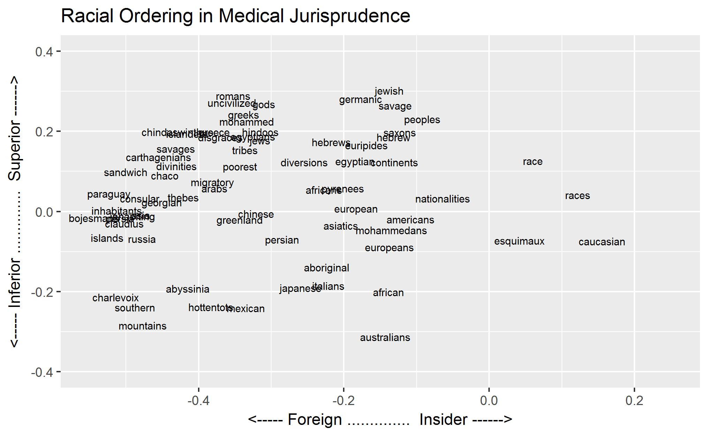

```{r, include=FALSE}
readRDS("document_list.RDS")
```


<H5>
<p>In 1926, two prominent Philadelphia surgeons, John Chalmers DaCosta and John F.X. Jones, published a chapter on railway injuries in the revised edition of *Legal Medicine and Toxicology.*^[*Legal medicine and toxicology*. 2nd ed. Vol. 1. Philadelphia, [1926]. 2 vols. *The Making of Modern Law*. Gale. 2016. Gale, Cengage Learning. 16 December 2016 <http://galenet.galegroup.com.mutex.gmu.edu/servlet/MOML?af=RN&ae=F153296571&srchtp=a&ste=14> (Author's local document_id:20004268501)] Addressing a mechanism of injury that affected several hundred thousand people annually, the duo diligently discussed the cause and traumatic effects of railway accidents, with a special emphasis on factors affecting the severity of injuries and recovery: sex, age, obesity, habits (such as alcoholism), temperament, and race:
 <blockquote>Jews, especially Russian Jews, often become frantic with terror after an accident and develop many secondary nervous phenomena. Negroes suffer considerably from fear, being usually very emotional. Warbasse reminds us that the negro, as seen in temperate climates, is less resistant to disease and injury than are the whites, and the death-rate among them is higher at all ages. The same author cautions us to bear in mind that the skull of the African negro is much thicker than that of the white. He says that mulattoes or mixed breeds present the weaknesses of both races and more deficient resistance than either. Warbasse also states that the Jewish people bear surgical operations well; and that injuries and operations are borne particularly well by the people who live exclusively, or nearly so, on a vegetable diet-the Chinese, Japanese, Indians, Mohammedans, and the peasantry of Europe.^[ *Legal medicine and toxicology*, 365.]
 </blockquote> 
The sober discourse of DaCosta and Jones incorporates accepted racial stereotypes (e.g., the nervous Jew, the sickliness of African Americans) into medical knowledge (e.g., the deleterious effects of anxiety upon medical outcomes, superiority of a vegetarian diet.) Couched in terms of science and jurisprudence, the language of differentiating risk groups overlaps, and even embraces, racialized assumptions that encourage political and social discrimination. 
</p>
<p>Such evidence of racial discourse during 19th and early 20th centuries exists in abundance. Racial terminology differentiated between various groups in fine detail, seeking to establish relative superiority or degrees of racial identity established through miscegenation. DaCosta and Jones' observations on railway trauma illustrate the complexity of gauging the proper arrangement of those identities based upon a single paragraph, never mind an entire document or across a set of texts: Jews recover more quickly from surgery, but Russian Jews seem to be less hardy. Are they more anxious than the Negro patient? Presumably, the Chinese are more likely to survive a railway injury because they eat a lot of vegetables.</p>

<p>The purpose of my research was to see if distant reading methods could be applied to a large set of texts to identify these comparisons in a systemic way and to map racial ordering *as it was perceived by their creators.* Using a word embededed model (WEM) of medical jurisprudence documents from *The Making of Modern Law* database, I was able to identify taxonomies of racial identity and to visualize these identities in multi-dimensional space. This visualization of spatial relationships and ordering between identities is intuitively recongizable and assists identification of further historical questions. This approach does not replace close reading, but guides the historian towards the most promising sources within a large corpus.</p>

<p>Race identity in the United States is a social construct that typically places “whiteness” as the standard against which other racial identities are defined. However, Eric Goldstein observes in *The Price of Whiteness: Jews, Race, and American Identity* that the “…black-white racial dichotomy has functioned in American history less as an accurate description of social reality than as an ideology.”^[Goldstein, Eric L. *The Price of Whiteness: Jews, Race, and American Identity.* Princeton: Princeton University Press, 2008, 3.] Instead of this binary, whiteness was understood in practice as a continuum of racial groups who could make increasing claims on whiteness and thus candidacy for full inclusion in American culture. Goldstein disagrees with scholars who “posit a fairly uncomplicated embrace of whiteness by immigrant groups... (and that) such ambiguity was quickly resolved as immigrants responded to overwhelming dominance of the black-white paradigm.”^[Goldstein, 4.] 
<p>
Michael Willrich’s *Pox*^[Willrich, Michael. *Pox: An American History*. New York: New York: Penguin Press, 2011.] and Natalia Molina’s *Fit to Be Citizens*^[Molina, Natalia. *Fit to Be Citizens?: Public Health and Race in Los Angeles, 1879-1939.* Berkeley, CA, USA: University of California Press, 2006.] examine operationalization of racial stereotypes in public health responses during the Progressive era. Willrich tackles racialization of public health as a by-product of limited knowledge. For example, scientific understanding of smallpox transmission at the time was that contagion through fomites (contaminated objects) was more virulent than face-to-face respiratory transmission, which created perception of smallpox as a “filth” disease.  While fomite infection does occur, this “long-standing association of smallpox with the filthy poor was grounded more in class and racial bias than in (today’s) medical reality.”^[Willrich, 349.]</p> 
<p>In *Fit to Be Citizens*, epidemiology as a subject is subordinated to a closer examination of the biases of public officials and their political weaponization of medical data. Molina’s approach to the question of racialization is a deep dive into the narrow geography and fragmented, nigh inscrutable, archives of Los Angeles County, California. Her study is important because it moves outside the familiar black-white binary that dominates racial discourse in the United States; Los Angeles County had a miniscule African American population during this period, while Mexicans, Chinese, Japanese, and poor whites competed for position within a racial hierarchy.^[Molina, 6-7.] The extent to which the "sound science" of the time accepted and perpetuated racial stereotypes is illustrated by official documents depicting the Chinese as disease carriers (not the conditions in which they lived), and asserting that Mexicans “shunned water, ...typhus was uniquely Mexican,”  and Japanese birth rates were a “yellow peril."^[Molina, 26, 69, 91.] Just as in *Legal Medicine and Toxicology*, credentialed authors grant authority to racial grading of inferiority and foreigness. </p>
<p> Like Goldstein, Molina rejects binary definitions of racial identity, describing a “…notion of race as a graded continuum shading from white, at the top, downward through various forms of “nonwhite,” represented by the city’s Chinese, Japanese, and Mexican populations.^[Molina, 6.] She subscribes to the construct described by Claire Jean Kim in *Bitter Fruit: The Politics of Black-Korean Conflict in New York City* that thinks of racial ordering 
<blockquote> …not as a single-scale hierarchy (A over B over C) but as a field structured by at least two axes: that of superior/inferior and that of insider/foreigner. Blacks and Whites constitute the major anchors (bottom and top, respectively) of this order, and incoming immigrants and other groups get positioned relative to these two loci.” ^[Kim, Claire Jean. Bitter Fruit: The Politics of Black-Korean Conflict in New York City. Yale University Press, 2000, 10. http://www.jstor.org/stable/j.ctt32bvk8.
] </blockquote></p>

<p>Kim’s construct is intriguing, but it is difficult to imagine directly mapping such ordering across a corpus. Texts that discuss race usually do not stop to say, for example, “A is superior to B, except when C is present. D and B are similarly superior, but B is considered more foreign.”  One approach to this challenge would be to manually search a set of documents for key words and build a table that counts instances of use, perhaps qualifying them with a grading scheme for the context in which they were applied. Beyond the laborious and time-consuming nature of such a project, this approach has has several vulnerabilities. First, the search terms would have to be defined by the user and rely upon serendipitous discovery^[Putnam, Lara. “The Transnational and the Text-Searchable: Digitized Sources and the Shadows They Cast.” The American Historical Review 121, no. 2 (4–1, 2016): 377–402. doi:10.1093/ahr/121.2.377, 386-387.] to add forgotten or unfamiliar terms. Second, manual assessment of racial order against a growing number of contexts would be subject to the biases of the person doing the grading and an increasing rate of error. As Lara Putnam warns, “….historians tend to attribute causality to what we see, without formal modeling to act as a brake on our tendency to do so.”^[Putnam, 390.] </p>

<p>Inspired by Ben Schmidt's post on Vector Space Models for the Digital Humanities^[Schmidt, Ben. "Vector Space Models for the Digital Humanities." Ben's Bookworm Blog, bookworm.benschmidt.org/posts/2015-10-25-Word-Embeddings.html. Accessed 11 November 2016.], I decided to use a similar approach to bring Kim's construct to life. My selection of source documents for this project was guided by two criteria: first, I wanted to view this subject through the lens of medicine as a source of racialization; second, the documents should be of fairly disciplined content type for the purposes of building and testing the method. The *Making of Modern Law*^[The Making of Modern Law. Gale. 2016. Gale, Cengage Learning. 16 December 2016 http://galenet.galegroup.com.mutex.gmu.edu/servlet/MOML?ste=23&vrsn=1.0&helppg=moml_search.htm&locID=viva_gmu&n=10] database, which contains 22,000 U.S. and British legal treatises published from 1800-1926, fit this criteria. Legal treatises provide explanations of law and guidance for applying it to various subjects such as forensics, malpractice, and public policy. Medical jurisprudence texts would have informed, at least indirectly, the work of public health officials discussed by Willrich and Molina. Therefore, it seems reasonable to infer that the racial discourse in medical treatises represents the racial discourse of most medical professionals during the same period</p>

<p>The corpus of 123 medical jurisprudence .txt files were read into R and processed using the wordVectors package to create a word embedded model (WEM).^[“bmschmidt/wordVectors.” GitHub. Accessed November 16, 2016. https://github.com/bmschmidt/wordVectors.] WEMs measure spatial relationships between words, which enables examination of these terms on the basis of their nearness to (similarity) or distance from (less similarity) each other. The model builds a vector representation of each word ("n" number of words most closely associated.) Instead of a simple "bag of words," the result of these measurements is a model that learns "...complex word relationships "^[Kusner, Matt J., Sun, Yu, Kolkin, Nicholas, and Weinberger, Kilian. “From Word Embeddings to Document Distances.” In Proceedings of the 32nd International Conference on Machine Learning, 957–66, 2015, 958-959. http://www.jmlr.org/proceedings/papers/v37/kusnerb15.pdf.] examining "not the scalar distance...but rather their various dimensions of difference. The "bag of words" is now properly packaged "baggage" that travels with individual term as a vector. Now, instead of comparing individual words against each other, whole vectors can be added and subtracted in analogous fashion to discover new relationships. For example, the analogy 'king is to queen as man is to woman' (would) be encoded... by the vector equation king − queen = man − woman."^[Pennington, Jeffrey, Richard Socher, and Christopher Manning. “GloVe: Global Vectors for Word Representation.” In Proceedings of the 2014 Conference on Empirical Methods in Natural Language Processing (EMNLP), 1532–43. Doha, Qatar, 2014, 1532. http://nlp.stanford.edu/pubs/glove.pdf.] 

<p>With the WEM constructed, the strategy for revealing racial ordering involved three steps: 1) creation of racial taxonomies, 2) measurement of racial identity according to those taxonomies, 3) creation of a comparison scales to replicate Kim's construct.</p>
</p>
<p>An advantage of building a WEM is that the analyst does not have to rely on a trial and error process of keyword searches to identify a set of related terms. As previously noted, keyword searches are at risk of being incomplete, inaccurate, and biased. Modeling will also be vulnerable to these risks, but the transparency of the code makes imperfections more identifiable. By using the WEM, terms were suggested by spatial relationships between the words themselves. I began with a set of "seed" labels ("race", "races", "racial") and then iteratively modeled a growing list of terms until a comprehensive list of overall racial terms was identified. This set was used to build the seed terms for individual racial groups and further modeling. As new words were identified for a specific group, they were added back into the overall racial terms list. </p>

<p>The modeling process required some decisions about inclusion of certain types of words. Modeling for racial terms quickly begins to include religion and geographic locations. For example, "Jew" refers to both race and religion; I included it in the list because the Jewish people are often treated as a race during this period. More generic terms, such as "ethnic" are included because they typically refer to people viewed as "other." Geographic terms were excluded if they could not also apply to a group of people, i.e., "germany" was excuded, but "germanic" was included. Lastly, anthropological terms such as "australoid" and "mongoloid" were largely excluded from the term sets, although they remerge in the modeling results. After much experimentation with the models, "caucasian" and "negroid" were included in the taxonomies because they appear to have entered non-anthropological vernacular to a significant degree.</p>

<p>The racial taxonomies for the medical jurisprudence texts are as follows: 
  <div id="bg">
  
   <div id="bg">
   </p>
<p>
Comparison of these taxonomies point to a defintion of "whiteness" guided more by what it *is not* versus what *it is* (caucasian and anglo-saxon). Likewise, Jewishness as a race is referred to alternatively only as "hebrew" and "tribes." Racial identity for other groups is (unsurprisingly) based on points of origin, color, and religion. Examination of sample texts suggest that direct reference to "whiteness" is usually assocated with forensic identification or in anthropological comparison to other races (eg. caucasion vs australoid). Otherwise, "whiteness" is implied unless specific less-white or more-foriegn teminology is introduced. 
</p>
<p>The term "irish" did not arise during the modeling of this corpus.  This is surprising, given their large scale immigration to the United States during this period and their history as "less white" than other groups.  A model of the term explains why: "irish" does appear in the texts, but not in significant relation to other racial terms in the combination of this scale (1800-1926) and this subject (medical jurisprudence.)  
```{r, echo=FALSE}
 mjp_irish <- readRDS("mjp_irish.RDS")

head(mjp_irish, 10)
```

<p>Step 2: The next step was to model the groups of words in each racial taxonomy to create vector sets of the 150 words most closesly associated with them. For example, the white racial vector was created thus:
  <div style="margin-left: 1em;">
    white_terms <- c("caucasian",  "saxons", "anglo")
    races_white = nearest_to(model,model[[white_terms]],150)
  </div>
resulting in a set of associated words similar to this shortened sample:</p>
```{r, echo=FALSE}
readRDS("mjp_races_white_nearest_to_sample.RDS")
```
<p>These lists of associated words for each group were then measured for their similarity to all of the racial terms in the WEM.^[I used the cosineSimilarity package that is bundled with wordVectors.] I plotted the results of these measurements in pairs to see if racial ordering could be usefully illustrated in this way.  The Asian versus White Vector plot is a typical example of the results:
)</p>
  <div id="bg">
  
   <div id="bg">
 
</div> 


<p>
The words in this plot do not define "asian" or "white"and the dividing line should not be interpreted as guidance for placing a particular word in one category or the other. The plot is a comparison of how similar each word is to "asian" or "white." It sets the two taxonomies in tension with each other as a theoretical binary sense of identity (Asian or White) that does not exist in reality. Indeed, this "binary" plot pulls in identities associated with non-Asian and non-White identities, supporting the concept that racial identity in practice is a process of triangulation.^[Kim, 16]</p>

<p>Step 3: Having created taxonomies and vector sets for each racial group, the final step was to create a pair of scales that aligned with Kim's construct: "...a field structured by at least two axes: that of superior/inferior and that of insider/foreigner. Blacks and Whites constitute the major anchors (bottom and top, respectively) of this order, and incoming immigrants and other groups get positioned relative to these two loci.”^[Kim, 10] The black/white scale was easy enough to create, but the insider/foreigner scale required a little more thought.</p>

<p>I tried several approaches to defining Kim's "insider." The "y" axis scale of Superior/Inferior per her definition is a continuum from White to Black. The challenge for the "x" axis is that the closest intercept between Inferior and Foriegner (the lower left quadrant) would have to share something in common. My first attempt involved treating racial groups as independent quadrants, e.g., placing Europeans as the insider versus Asians as more foriegn. No matter the arrangement, the results were muddled. My second approach to the problem was to create vectors of class distinction, using term sets of social position and occupations (e.g., "lady, gentleman, doctor" vs "prostitute, peasant, servant") to determine insiderness. Modeling results were unsatisfactory, yielding very little relation to each other or to racial terms. Finally, I reconsidered the implications of Molina and Kim's depictions of racial continuums. In this context, "whiteness" is both the ultimate superiority *and* insiderness in the U.S. By definition, all else is shades of "not-white" and "less-superior." Therefore, a scale that placed "all races" in a continuum against "white" was created to measure insider/foriegn status on the "x" axis.</p>
<p>Graphing racial terms against this pair of scales reveals racial ordering of all groups as it exists within the medical jurisprudence corpus:</p>
<div id="bg">
  
</div>  

<p>The graph represents ordering of racial terms in relation to each other in multi-dimensional space. The absolute numerical positioning of a particular term is less important than its nearness or distance from another. One can see at a glance, for example, that "arabs" are perceived as more foreign than, but superior to "italians."  Goldstein's observation that European immigrants were not monolithically white^[Goldstein, 4] is reflected in their relative positioning. Visualization of these spatial relationships provides an intuitive interface for identifying historical questions.</p>
<p>A couple of examples serve to illustrate the utility of the model for developing historical questions:</p>
<ol>
<li>Anthropological term use: "Caucasian" and "australoid" float far to the right on the Insider scale, in close proximity but isolated from most of the other terms. "Mongolians" are also far to the right, but inferior to the other two terms. The term "australoid" appears solely in a 1907 treatise, *A System of Legal Medicine*^[Hamilton, Allan McLane. *A system of legal medicine*. 2nd ed. Vol. 1. New York, 1907 c[1900]. 2 vols. *The Making of Modern Law.* Gale. 2016. Gale, Cengage Learning. 16 December 2016, 59. <http://galenet.galegroup.com.mutex.gmu.edu/servlet/MOML?af=RN&ae=F3751350215&srchtp=a&ste=14> (Author's local document_id 20001902501)] It is used five times in explanation of anatomical characteristics that assist in forensic identification of a corpse. "Caucasian" appears in 21 documents (17% of the corpus) and is used in the context of forensic analysis and determination of the race of offspring. Despite the physical distance between the two terms, the WEM has correctly measured their semantic nearness. The term "mongolians" is likewise used in anthropological context, but is also associated with a class of mental and physical disorders associated with Down's Syndrome (once known as "mongoloidism.") This may explain the inferiority of the term compared to the others. The "insiderness" of these terms may be attributed to their use in the more exclusive fields of anthropology and forensic medicine. It would be interesting to experiment with vector rejection (e.g., the vec(King) - vec(Queen) example) to better define the outlines of this exclusivity and where it shows up in the texts.</li>
<li>Chinese and Japanese Ordering: The chart positions "chinese" as superior to, but more foriegn than, "japanese." Molina's text describes racialization of both groups as disease carriers and ties it to anxieties over economic competition and birth rates.^[Molina, 31-60] However, the relative positioning of the terms in relation to each other is not fully explained by Molina's narrative. </p>

 <div id="bg">
  
   <div id="bg">
<p>These terms appear in 32 documents in the medical jurisprudence corpus. Visualization of the number of times each term is used, and when, indicates that the references are infrequent across the corpus and dominated by mention of the Chinese. Reference to the Japanese skews toward the end of the 19th and early 20th century. Examination of the documents provides some clues to perceptions of the two groups. *A Manual of Legal Medicine*^[Herold, Justin. *A manual of legal medicine : for the use of practitioners and students of medicine and law*. Philadelphia, 1902. *The Making of Modern Law*. Gale. 2016. Gale, Cengage Learning. 16 December 2016 <http://galenet.galegroup.com.mutex.gmu.edu/servlet/MOML?af=RN&ae=F151351542&srchtp=a&ste=14>], published in 1902, references the Chinese in three ways: the first mention discusses an alternative fingerprint method used by the Chinese; in the second instance, they are a subject of the Bertillion identification system characteristics; and lastly they are part of a discussion about nations that still authorize abortion."^[*A Manual of Legal Medicine*, *vi*, 206, 215 444] The Japanese are mentioned in the same discussions about Bertillion methods and abortion; the final reference is to the autopsy of an executed Japanese criminal.^[*A Manual of Legal Medicine*, 206, 400, 444] Fourteen years later, *Legal Medicine and Toxicology* re-used the example of Chinese fingerprinting methods, reasserts the Bertillion racial typing discussion, and mentions the positive effects of the Chinese and Japanese diets.^[*Legal Medicine and Toxicology*, 93, 138, 141, 161, 365]</p>
<p>If we zero out the Bertillion, abortion, and diet references (where the Chinese and Japanese are mentioned with equal sentiment), the Chinese have an advantage in positive (or at least neutral) mention for their fingerprinting methods while the Japanese are left with a criminal association.
These examples, along similar content in the other documents associated with these terms, illustrate Putnam's concerns about keyword searching as a method for analysis: the results of this little experiment are interesting, but no substitute for reading and understanding the body of work. They also return us to the difficulty of manually calculating racial order. The differences expressed are slight, suggesting that a cumulative measurement of these spatial relationships is the only way to make sense of them. This is also a very small sample set; further modeling against a larger set of documents would give greater confidence in the scaling.</p></li>
</ol>
<p>The methods used herein demonstrate the power of Word Embedded Models to reveal taxonomies and social ordering from a large(ish) set of texts. The results of this modeling provide a more sophisticated tool for historians to assess a corpus and efficiently develop promising lines of inquiry. Although the focus in this paper has been on racial terms, these methods have potential to model class, gender, or others types of categorization appropriate to the texts under consideration. 
Potential future research related to the work in this paper includes:</p>
<ol>
<li>Apply the method to special collections document set (e.g., African American and Jewish newspapers) to assess how racial ordering differs from the MOML, which is predominately authored by elite white males.</li>
<li>Experiment with vector rejection to examine the influence of anthropological terms (caucasian, australoid, mongoloid) on racial discourse.</li>
<li>Apply the method to a larger MOML data set in order to assess effectiveness at a increased scale.</li>
<li>Apply the method to U.K. medical jurisprudence to compare racial ordering outside of the U.S.</li>
<li>Apply text re-use modeling to the medical jurisprudence corpus to examine how racial attitudes are carried forward in the texts.</li>
</ol>


